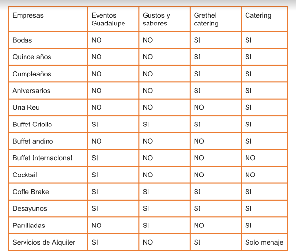

  
   
# INFORMACIÓN DE NEGOCIO
## RETO:

## PREINVESTIGACIÓN:    
### DEFINICION:
Se denomina cáterin al servicio de alimentación institucional o alimentación colectiva que provee una cantidad determinada de comida y bebida en fiestas, eventos y presentaciones de diversa índole.
Cuando la mayoría de las personas hablan de un cáterin, se refieren al servicio de alimentación prestado por una empresa especializada. Esta se encarga de preparar, presentar, ofrecer y servir comidas en todo tipo de eventos, que van desde un simple desayuno, hasta servicio completo tipo restaurant con mesoneros, cocina, decoración y limpieza. La comida puede ser preparada completamente en el lugar del evento, ó bien, prepararse antes y darle los toques finales una vez llegue.

### DETALLES DEL SERVICIO:
En el servicio se puede incluir desde la propia comida, la bebida, la mantelería y los cubiertos, hasta el servicio de cocineros, camareros y personal de limpieza posterior al evento.
Al realizar un presupuesto o una propuesta de servicio, un evento de cáterin puede incluir los siguientes elementos:

**Consideraciones generales**
Deben tomarse en cuenta las necesidades específicas del cliente, ya sean de índole dietético o religioso.

**Aperitivo**
Deben asegurarse si se van a pasar o se ofrecerán de forma estacionaria. La mayoría de los proveedores de catering concuerdan que es apropiado pasar tres o cuatro variedades de canapés una hora antes de la comida.

**Servicios de alquiler**
Puede incluir mesas, sillas, pista de baile, plantas, utensilios de mesa (vajilla, cubiertos, cristalería, mantelería, posavasos e individuales), cristalería de bar, recipientes para servir, saleros, pimienteros, etc. 

**Personal de servicio**
Varían de un proveedor a otro, pero por lo general, un evento deberá tener un líder/capitán/gerente del evento, un chef, un ayudante de cocina (sous chef), meseros y un barman. 

### ALGUNAS PRESENTACIONES: 
Las presentaciones más comunes para los alimentos son las siguientes:

**Catering cocktail**
El horario estimado de realización es de 11 a 13 o de 19 a 21 horas. Se calculan de quince a veinte bocados por personas; salados 2/3 y dulce 1/3.

**Catering recepción buffet**
Al igual que el anterior, su duración es de tres horas y el horario estimado es a las 20 horas. Pero en este caso, se ofrecen variedades de platos fríos, calientes y guarniciones.

**Catering recepción, comida o banquete**
Se contrata para eventos de larga duración, ya que se calculan entre seis y ocho horas y su horario estimado es de 22 horas. En este catering se calculan seis bocados para la recepción y luego, en la cena, encontramos la entrada, el plato principal, el postre, un servicio de café, el brindis, la mesa dulce y el final de la fiesta.

**Catering desayuno de trabajo**
Se calculan entre tres a cinco bocados por hora por persona y se puede elegir entre continental o americano, entre otros.

**Catering vernissage**
Se ofrecen dos bocados por persona, champagne y vino. Este catering se realiza mayormente en inauguraciones de muestras de pinturas.

**Catering coffee break**
Se ofrece café, té, jugos y bocaditos salados y dulces. Dura entre 15 y 30 minutos y es básicamente un corte o recreo.

### ARTÍCULO RELACIONADO:
* [Catering en el Perú](https://gestion.pe/tendencias/90-quienes-brindan-servicios-catering-son-personas-naturales-56461)

## BUSINESS CANVAS MODEL:

## KICK OFF:     
**Preguntas a stakeholders**

* ¿Qué tipo de servicio tiene mayor venta o aceptación en el público?
* ¿Qué sería lo que se debe resaltar más?
* ¿Cuál es el servicio que menos consumen?
* ¿Cuál es el % de clientes nuevos el último año?
* ¿Cuál es el % de clientes perdidos el último año?
* ¿Cuáles son las cosas que el cliente desearía cambiar en el servicio?
* ¿Cuáles son los adicionales más solicitados?
* ¿Cuál es el mayor problema a la hora de atender un pedido?

## PROCESO UX
### INVESTIGACIÓN
**ENTREVISTAS**

1. Entrevista a Usuarios

 

  * [Respuesta de Entrevistas ]()

2. Entrevista a Stakeholders

  * [Respuesta de Stakeholders](https://drive.google.com/open?id=1nmbYCwqGCXXpzw9A_bMAlkXIah-siT2n)

3. Opiniones en Internet

 

  * [Opiniones](https://www.matrimonio.com.pe/debates/opiniones-sobre-catering--t1500)

### BENCHMARK

### SÍNTESIS

**USER PERSONA**

**PROBLEM STATEMENT**

**HMW**

**WHAT IF**

**JOURNEY MAPS**    

### IDEACIÓN
**FEATURE LIST**

**PRIORIZACION**

**MVP**      
De acuerdo a la investigación realizada y con las ideas propuestas. Nuestro producto será un "Sitio Web" y dentro de su contenido tendrá lo siguiente:    
*    

### PROTOTIPADO  

**PAPER PROTOTYPE** 
* 1er PAPER PROTOTYPE 

 

* 2do PAPER PROTOTYPE 

 

* 3er PAPER PROTOTYPE 

            

**PROTOTIPO DE ALTA FIDELIDAD** 

Enlace a [BankEva](https://marvelapp.com/c4i70ce)   

### TESTING 
